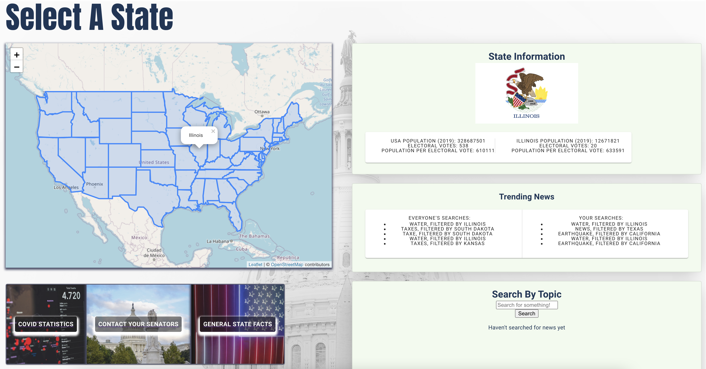
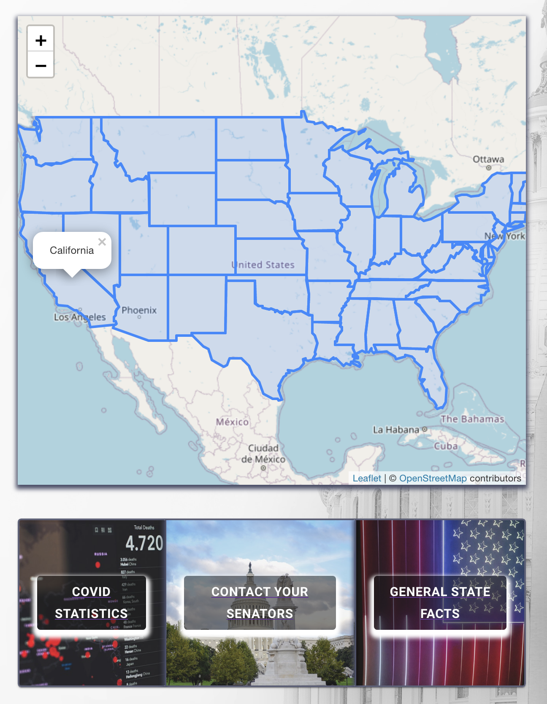
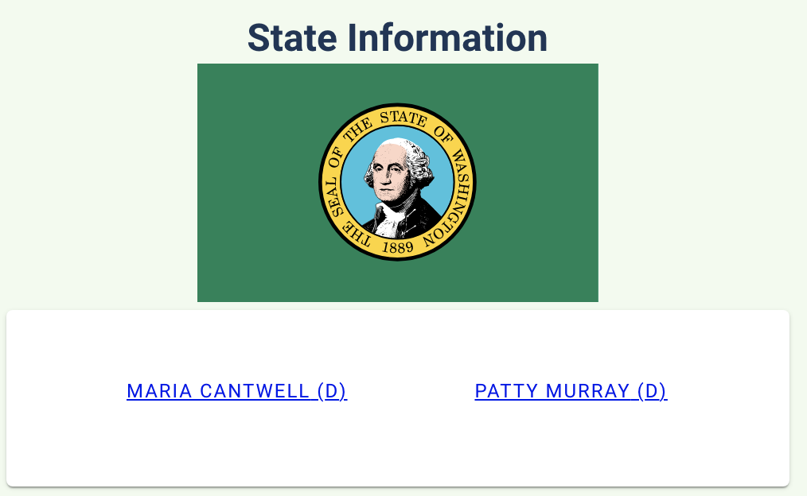
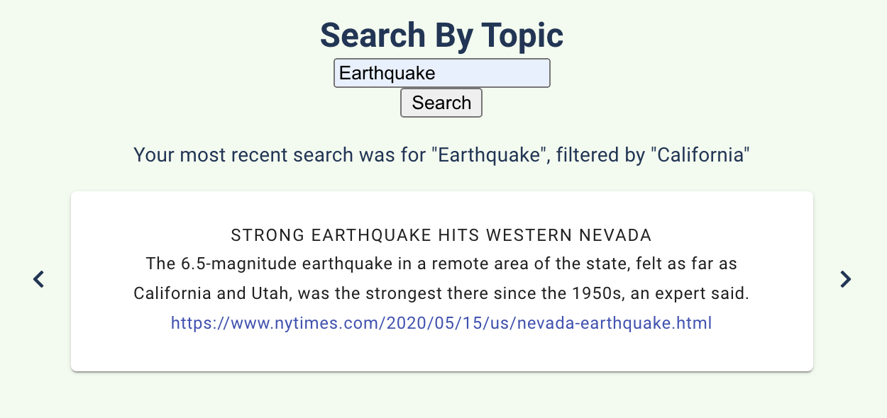
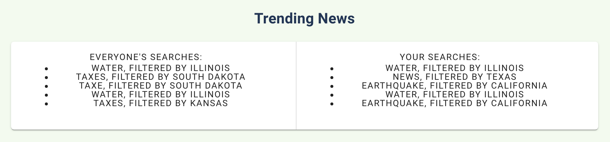

# Simple State

## Deployed Website:
### [https://project-three-2020.herokuapp.com/](https://project-three-2020.herokuapp.com/)

## DESCRIPTION
"No Alternatives, Just Facts"  
As someone who is not always interested in reading from dozens of different sources on the daily, and getting overwhelmed with unneccessary content, "Simple State" is the place to quickly acquire data-driven information. 
"Simple State" is a single-page application and an all-encompassing platform, with immedidate access to up-to-date Covid Statistics, state facts, contact information for US senators, and filtered news searches.

## SCREENSHOTS

### Login and Signup Pages

### Full Home Page

### Map Selection and Button Options

### Contact Your Senators

### News Search and Display Cards

### Trending News

## TABLE OF CONTENTS
* [Installation](#installation)
* [Usage](#usage)
* [License](#license)
* [Contributing](#contributing)

## INSTALLATION
- No installation is required, as the user can simply visit the deployed application link: [https://project-three-2020.herokuapp.com/](https://project-three-2020.herokuapp.com/)
- However, if the user wishes to investigate the code locally, the following steps should be performed:
    - Clone the repo for use on your local machine
    - Use the command line to locate the cloned repo and make it your current directory
    - Type `npm install` in the command line; this will install the necessary node module packages and dependencies

## USAGE
- To run the application locally...
    - Use the command line to locate the cloned repo and make it your current directory
    - Ensure that a local database connection to MongoDB is open and running
    - Simply type `npm start` in the command line
    - This will open a localhost connection on your default browser, wherein the React application will run
- To run the application online, please visit the deployed link: [https://project-three-2020.herokuapp.com/](https://project-three-2020.herokuapp.com/)
- Application functionality is identical whether you are running the server locally or visiting the deployed link:
    - Upon arriving at the page, users can either sign-up or log-in
    - Once the user is logged-in, they arrive on the "Simple State" landing page, with features styled by [Material UI](https://material-ui.com/)
    - The user selects one of the continguous United States, utilzing a map feature designed with [Leaflet](https://leafletjs.com/index.html) and [React Leaflet](https://react-leaflet.js.org/)
    - Upon selection of a United State, associated relevant data becomes subsequently accessible
        - Covid-19 - up-to-date statistics, sourced from [The Atlantic](https://covidtracking.com/)
        - Senators - contact your representatives via Twitter, sourced from [ProPublica](https://projects.propublica.org/api-docs/congress-api/)
        - State Facts - learn about population, electoral college votes, and more, sourced from the [US Census Bureau](https://www.census.gov/)
    - The user can also search for news articles (sourced from the [New York Times](https://developer.nytimes.com/)), which are filtered by the selected United State
        - All news searches are saved to the database (POST)
        - News searches are also retrieved from the database (GET); they undergo several filters before being displayed as "trending news"
            - They are sorted by date (to retrieve only the most recent searches)
            - They are filtered by user, so that the user can see their most recent search history, alongside the entire community's most recent searches 
    - At any point and time, the user can re-select a different United State, and the corresponding information will update to match that state

## LICENSE
License: MIT License 
[https://opensource.org/licenses/MIT](https://opensource.org/licenses/MIT)

## CONTRIBUTING
- [https://github.com/JPBrickhouse](https://github.com/JPBrickhouse)
- [https://github.com/ARBarber0510](https://github.com/ARBarber0510)
- [https://github.com/jeffreykornfeld](https://github.com/jeffreykornfeld)
- [https://github.com/kbaur775](https://github.com/kbaur775)
